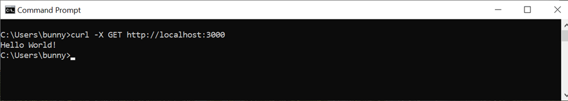
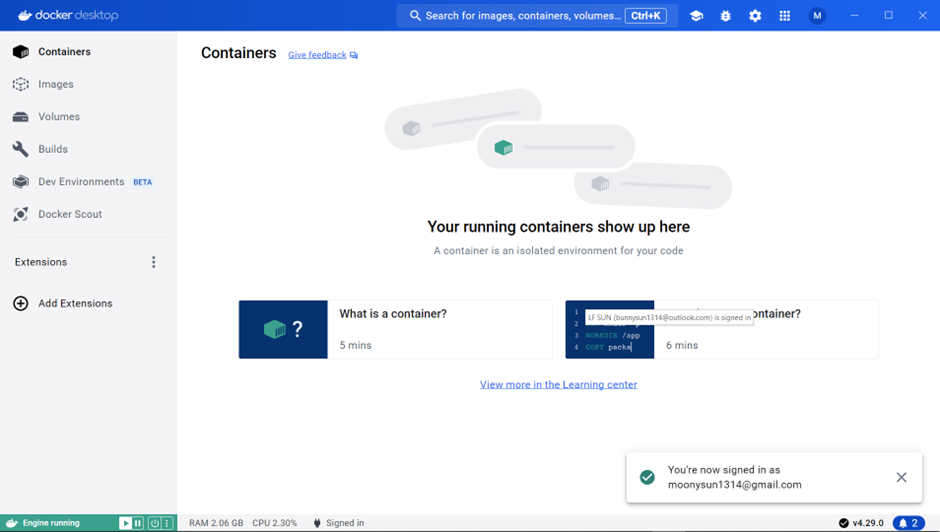
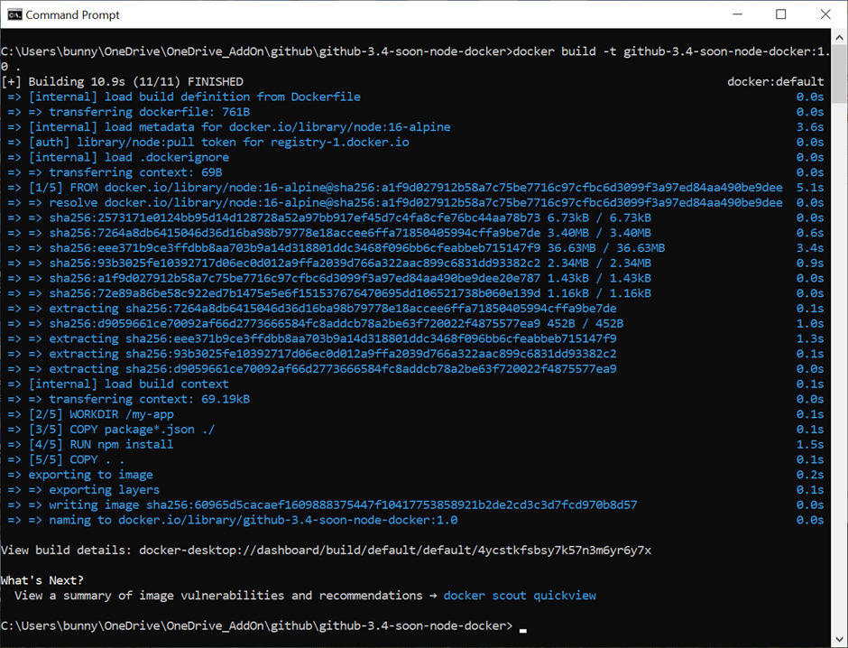
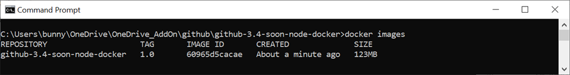
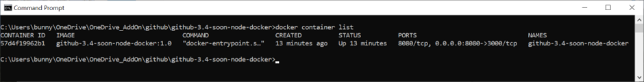
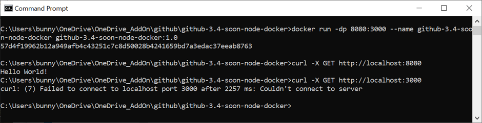
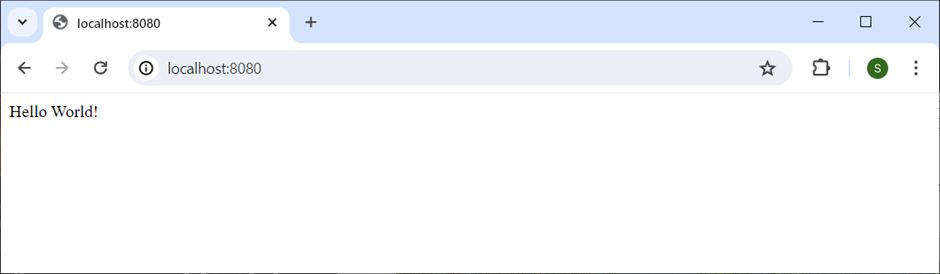
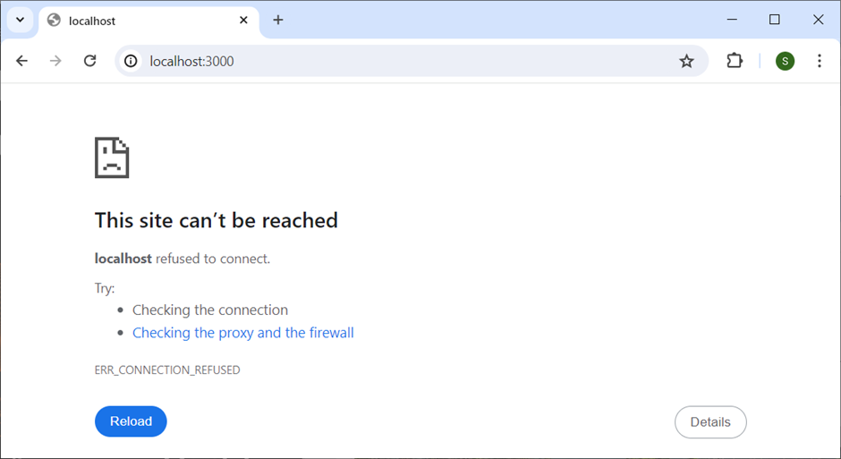

"# github-3.4-soon-node-docker" 



Before dockerisation, the output from the Node application via the browser and Command Prompt window are as shown above. The Node application is listening at TCP port 3000.


In Windows, you must start the Docker Desktop for Windows, before you can run the docker command at the Command Prompt window.


Use the following command to build the Docker image for the Node application.
``` sh
docker build -t github-3.4-soon-node-docker:1.0 .
```


Use the following command to list the Docker image(s) stored in the docker local repository (in the local host).
``` sh
docker images
```


Use the following command to list the running Docker container(s):
``` sh
docker container list
```


After dockerisation, the output from the Node application via the Command Prompt are as shown above.

Note that the Node application is still listening at TCP port 3000 internally within the container. But this port is exposed at 8080 to the outside world at the local host. In order words, you no longer can access the Node application (now is inside a container) via port 3000. If you access the container using port 3000, you will get an error message (as per the second curl command shown in the above screenshot).


You can only access the dockerised Node application via port 8080. 


You can no longer access the dockerised Node application via port 3000.

